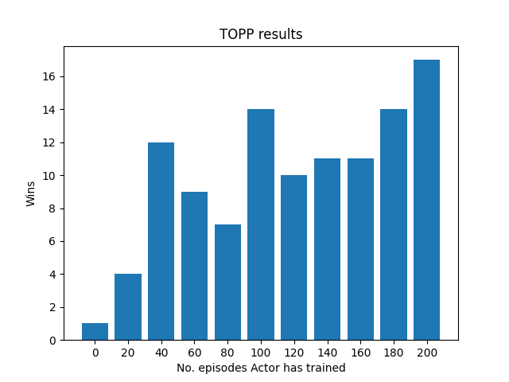

# MCTS for Game Playing ♟

This project was part of the Artificial Intelligence Programming (IT3105) course at NTNU spring 2022. The aim of this project was to implement a Monte Carlo Tree Search (MCTS) system and combine it with Reinforcement Learning (RL) and Deep Learning (DL) to play the board game Hex.

## Monte Carlo Tree Search

In this project an on-policy MCTS approach (i.e., the target policy and behavior policy are the same) was employed, and that policy was implemented as a neural network. MCTS then provided training cases for that policy network, in the same spirit as Google DeepMind’s use of MCTS to train deep networks for playing Go, chess and shogi. That same network, in fulfilling its role as the behavior policy, guided rollout simulations in MCTS. An overview of how the MCTS search is shown below:

## Reinforcement Learning Algorithm

The RL procedure involves three main activities:

1. Making actual moves in a game, with many such games being played. Each completed actual game constitutes
an episode in this form of RL.

2. Making simulated moves during MCTS, also called search moves, with any
sequence of search moves leading from an initial to a final state deemed a search game. Each actual move taken
in an episode will be based upon hundreds or thousands of search games in the MC tree.

3. Updating the target policy via supervised learning, where training cases stem from visit counts of arcs in the
MC tree.

Below is an overview of supervised learning of the target policy network based on results of Monte Carlo Tree Search
(MCTS):

Numbers on MCTS branches denote visit counts accrued during the multiple search games associated with
each single move in the actual game. Each case (yellow box) is stored in the Replay Buffer and used for training at the
end of each episode; an episode involving m moves adds m cases to the Replay Buffer. PID = Player Identifier.

## Hex ♦️

Hex, also known as Con-tac-tix, is played on a diamond-shaped grid with hexagonal connectivity. Two players (black and red) alternate placing single pieces on the grid. Placed pieces can never be moved or removed. Each player ”owns” two opposite sides of the diamond and attempts to build a connected chain of pieces between those two sides; the first player to do so wins. It can be proven mathematically that ties are not possible: a filled Hex board always contains at least one chain between opposite sides. In this project, red owns the northwest and southeast sides, while black owns the northeast and southwest sides. An example game of 5x5 Hex, where red player wins, is shown below:

## TOPP (Tournament of Progressive Policies)

In order to measure the improvement of the target policy over time, the current state (i.e weights, biases, etc.) of the ANET is periodically saved to a file. By doing this M times during one complete run of the algorithm, M different policies will be produced. For example, if we train for a total of 200 episodes with M=5, we will have ANETs trained for 0, 50, 100, 150 and 200 episodes. The saved policies can then be reloaded into M different agents whose relative Hex skills can be assessed by a simple tournament. This will has a round-robin format: every agent plays every other agent in one series of G games. For example, if M = 5 and G = 25, then there will be 5 * 4 = 10 different series, each involving 25 games.

## Configuration files ⚙️

It is possible to configure Hex, MCTS, RL system, TOPP and ANet parameters in the config files. The config files are located in the [configs](/configs/) folder.

## Installation 📦

To install the required packages, use the following command: `pip install -r requirements.txt`

## Running a model

To train/run TOPP, the model architecture, Hex game, etc. needs to be specified. This is done in a [configuration file](#configuration-files). You could either modify an existing config file, or create your own config file and specify the path to it in the `main()` function in the `main.py` file. To create, train and test the model in TOPP, run the main.py file: `python main.py`. To skip training, set `training=False` in the main method.

## Results ✅

Below is a run of TOPP on 5x5 Hex, with models trained up to 200 episodes:

As seen in the plot, there is a correlation between the number of episodes a model has trained for and how many wins it has.

## Future work 🚀

Future work on this project could include:

* **Play other games**: In this project, the MCTS approach was tested on Hex and Nim, but it would be interesting to see how well this approach works with other two-player games. One should keep in mind that game complexity could increase the number of possible moves in each state and the resources needed to calculate them, which in turn would affect the time and resources (like computing power and memory) needed to train the models. Games with simple rules and relatively few possible game states would therefore be preferable.

* **Optimize code**: Training can take a long time, and optimizing the MCTS, RL and Hex code could help speed this up. There has already been an optimization of the ANet by using LiteModel from TensorFlow.
