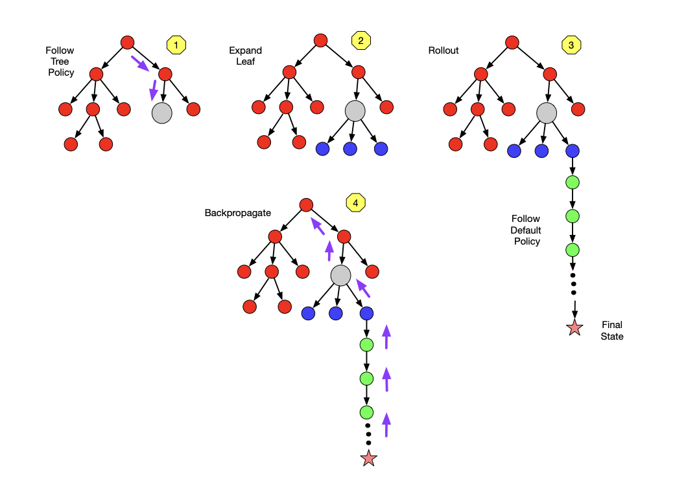
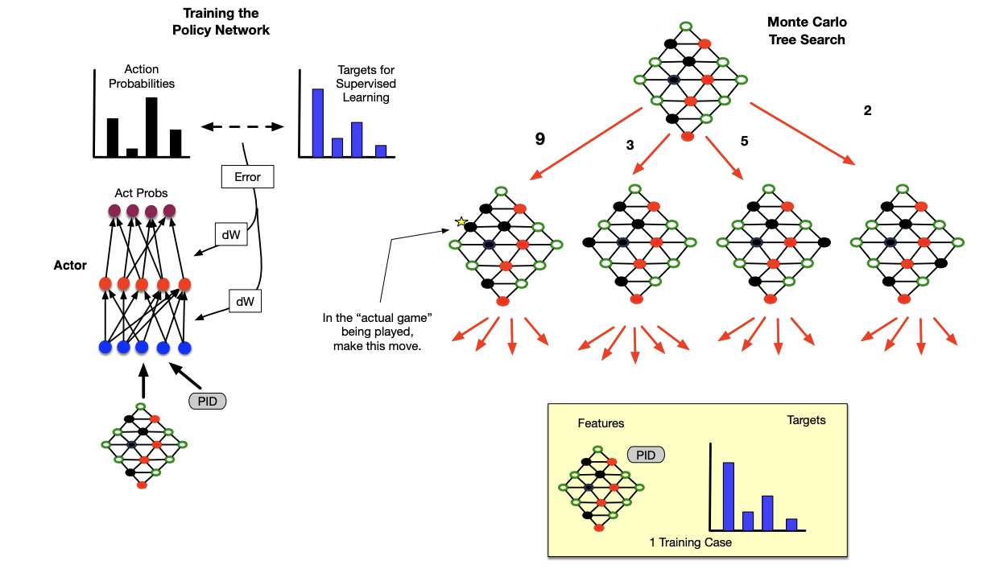
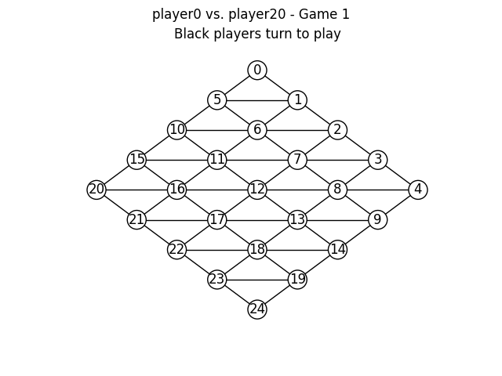

# MCTS for Game Playing ♟

This project was part of the Artificial Intelligence Programming (IT3105) course at NTNU spring 2022. The aim of this project was to implement an Monte Carlo Tree Search (MCTS) system and combine it with Reinforcement Learning (RL) and Deep Learning (DL) to play the board game Hex.

## Monte Carlo Tree Search

In this project an on-policy MCTS approach (i.e., the target policy and behavior policy are the same) was employed, and that policy was implemented as a neural network. MCTS then provided training cases for that policy network, in the same spirit as Google DeepMind’s use of MCTS to train deep networks for playing Go, chess and shogi. That same network, in fulfilling its role as the behavior policy, guided rollout simulations in MCTS. An overview of how the MCTS search is shown below:

## Reinforcement Learning Algorithm

The RL procedure involves three main activities:

1. Making actual moves in a game, with many such games being played. Each completed actual game constitutes
an episode in this form of RL.

2. Making simulated moves during MCTS, also called search moves, with any
sequence of search moves leading from an initial to a final state deemed a search game. Each actual move taken
in an episode will be based upon hundreds or thousands of search games in the MC tree.

3. Updating the target policy via supervised learning, where training cases stem from visit counts of arcs in the
MC tree.

Below is an overview of supervised learning of the target policy network based on results of Monte Carlo Tree Search
(MCTS):

Numbers on MCTS branches denote visit counts accrued during the multiple search games associated with
each single move in the actual game. Each case (yellow box) is stored in the Replay Buffer and used for training at the
end of each episode; an episode involving m moves adds m cases to the Replay Buffer. PID = Player Identifier.

## Hex ♦️

Hex, also known as Con-tac-tix, is played on a diamond-shaped grid with hexagonal connectivity. Two players (black and red) alternate placing single pieces on the grid. Placed pieces can never be moved or removed. Each player ”owns” two opposite sides of the diamond and attempts to build a connected chain of pieces between those two sides; the first player to do so wins. It can be proven mathematically that ties are not possible: a filled Hex board always contains at least one chain between opposite sides. In this project, red owns the northwest and southeast sides, while black owns the northeast and southwest sides. An example game, where red player wins, is shown below:

# Configuration files ⚙️
